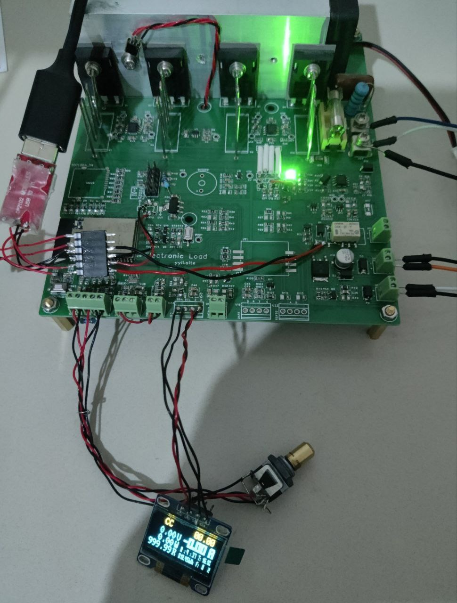

# 自制电子负载

[Electronic_load_idf](https://github.com/yyii-site/Electronic_load_idf)项目的硬件重新使用Arduino编写程序

## 硬件组成

## 硬件问题和变更

| 变更                             | 原因                |
| ------------------------------- | ------------------- |
| U23接正极(+)   U24接负极(-)       | 丝印错误             |
| R81阻值NA                        | 上电要求I02必须为低   |
| U18的1脚由KEY改作1-Wire接口       | IO35仅可作为输入端口   |
| R7/R8/R9/R10取样电阻改为0.1Ω康铜丝 | 封装错误             |
| ads1110的供电由3V3_A改为3V3_D     | 芯片内自带参考基准     |
| R44阻值NA                        | 风扇使用12V供电      |
| R43阻值0Ω                        | 风扇使用12V供电      |
| R96/R98/R99阻值0Ω                |                    |
| R7/R8/R9/R10公共端与OUT_GND短接   | 采样电阻负端未接地    |

## 项目进度

实现电子负载基本功能:

电压\电流采样及显示
功率\电阻计算及显示
目标电流可通过编码旋钮设置(单击换位/旋转修改数字)
散热器温度采集,根据温度调节风扇转速控制
17V 3A 51W测试.

## 开发

VSCode + platformio

下载及串口通讯使用USB-TTL模块

### platformio.ini

u8g2库的I2C默认使用Wire,需增加此参数用以启用Wire1总线.

`build_flags = -D U8X8_HAVE_2ND_HW_I2C` 

之后即可使用:

`U8G2_SSD1306_128X32_UNIVISION_F_2ND_HW_I2C u8g2(U8G2_R0);`
